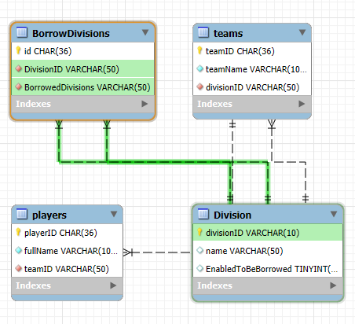
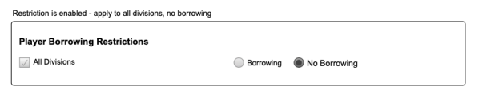
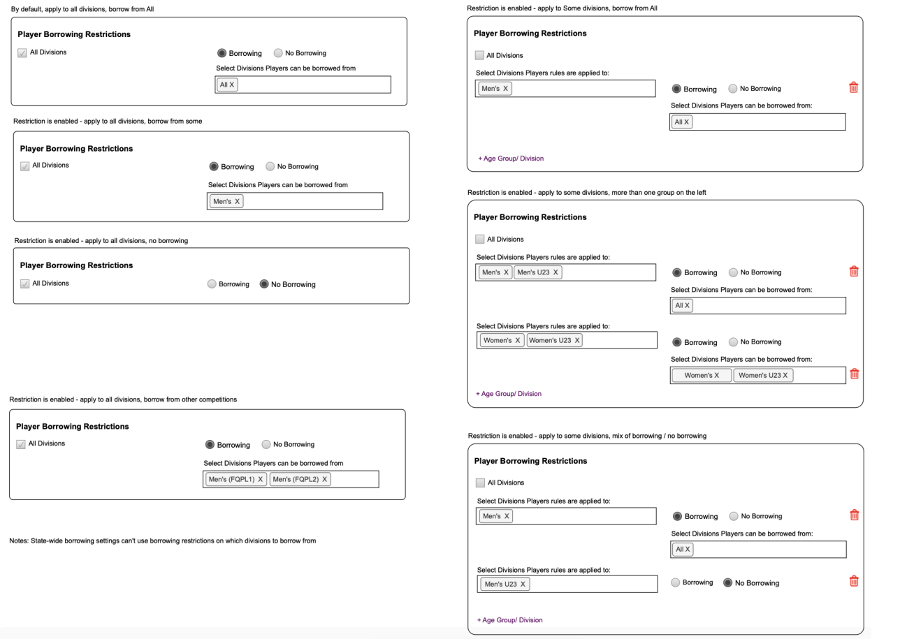

## ER diagram: 



Explanation:

- Division table, which has divisionID as primary key or uniqueID.
- BorrowDivisions table, which has FOREIGN KEY for divisionID, BorrowedDivisions as REFERENCES from Division table (divisionID).
- Teams table, which each team can belong to only one division.
- Players table, which players belong to existing team.


## MySQL and functions
### 1. EnabledBorrowDivision
   

I create function called `enabledBorrowDivision()` that can apply to all divisions, no borrowing. I can loop for each divisionID to update it and we can handle with the UI if user selects `ALL` option it can run query to collect divisionID to push into an array then loop with this function.

```Sql
SELECT divisionID from Division;
```
Funtion code: 
``` typescript
async function enabledBorrowDivision(reqBody: updateDivisionReq): Promise<void> {
  const connection = await mysql.createConnection(connectionConfig);
  const { maindivision } = reqBody;

  try {
    await connection.beginTransaction();
    if (maindivision.length > 0) {
      const placeholders = maindivision.map(() => '?').join(',');
      const sql = `UPDATE Division SET EnabledToBeBorrowed = false WHERE divisionID IN (${placeholders})`;
      await connection.execute(sql, maindivision);
    }

    await connection.commit();
  } catch (error) {
    await connection.rollback();
    throw error;
  } finally {
    await connection.end();
  }
}
```


### 2. updateDivisions
I decide to encapsulate all features in `updateDivisions()` function as array of request body (look like below). Also I can loop for each divisionID to update it and we can handle with the UI if user selects `ALL` option it can run query to collect divisionID to push into an array then loop with this function.

``` typescript
// exampleReqBody
 [
  {
    maindivision: ['Men_TEAM_ID', 'MenU23_TEAM_ID'], 
    borrowDivisions: ['MenFQPL1_TEAM_ID', 'MenFQPL2_TEAM_ID']
  },
  {
    maindivision: ['Women_TEAM_ID'],
    borrowDivisions: ['WomenU23_TEAM_ID', 'Women_TEAM_ID']
  },
  { 
    maindivision: ['MenU23_TEAM'],
    borrowDivisions: false // Set EnabledToBeBorrowed to false/ true
  }
];
```





### 3.updateFinalesEligibility

It's similar logic to `updateDivisions()` I decide to encapsulate all features in `updateFinalesEligibility()` function as array of request body (look like below). Also I can loop for each divisionID to update it and we can handle with the UI if user selects `ALL` option it can run query to collect divisionID to push into an array then loop with this function.
```typescript
[
  {
    enableFinal: true,
    divisions: ['Men_TEAM_ID', 'MenU23_TEAM_ID'],
    minRoundOfMatch: 10,
    EligibleRound: ['R1', 'R2', 'R3']
  },
  {
    enableFinal: false,
    divisions: ['Women_TEAM_ID'],
    minRoundOfMatch: 10,
    EligibleRound: ['R1', 'R2']
  }
];
```


## Any improvements you would like to make?
I know that this solution may not be perfect. If I have more time further developing it, I would concentrate on these areas:

- Create db libraries that allows to use globally
- Extract each query to be used for specific functions
- API testing with actual request body
- Restructure and cleaned up.
- Deploy to the live-server that you don't need to run locally to play around.
- Provide unit-test and integration test.
